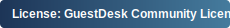

[](LICENSE)

# GuestDesk

GuestDesk is a Flask application that helps shelters, day resource centers, and similar service providers run a public-facing guest portal alongside an internal staff console. The stack powers GRACE Marketplace today and is designed so other communities can adapt it with minimal technical overhead.

---

## Why GuestDesk?
- **Single place for guests** to check daily services, announcements, and fun-zone games in English or Spanish.
- **Actionable reporting** that channels grievances, maintenance requests, and suggestions into trackable workflows with optional photo uploads and email alerts.
- **Staff-ready admin** tools for editing services, managing the schedule, approving announcements, and reviewing submission history or audit logs.
- **Operational visibility** via optional privacy-aware analytics and lightweight dashboards that highlight usage trends.

---

## Feature Highlights
- **Public guest site** with localized navigation, service directory, announcement feed, calendar, and `/calendar.ics` export for subscribing to programs.
- **Feedback intake** forms that persist submissions to SQLite, deduplicate via Redis-backed idempotency, and notify staff by category.
- **Admin console** ( `/admin` ) covering service CRUD, recurring schedule management, audit log viewer, and per-category submission queues.
- **Security posture** that defaults to CSRF protection, secure headers (Flask-Talisman), rate limiting, and request ID propagation.
- **Background work** handled through Redis + RQ for email delivery, keeping the web tier responsive even on lower-powered hardware.

---

## Architecture at a Glance
- **Web app**: Flask factory in `guestdesk/app.py` with Blueprints for analytics collection and calendar feeds.
- **Database**: SQLite by default (see `GUESTDESK_DATA_DIR`) managed through SQLAlchemy models in `guestdesk/models.py`.
- **Cache & queue**: Redis powers rate limiting, form idempotency (`guestdesk/antispam.py`), and background jobs (`guestdesk/task_queue.py`).
- **Static + templates**: Jinja2 templates in `templates/` and assets in `static/` underpin both the guest portal and admin UI.
- **Analytics**: Optional endpoint at `/analytics/collect` that stores anonymized session data in `analytics_events`.
- **PDF tooling**: Legacy helpers under `pdf_render.py` remain available for custom mail attachments if needed.

---

## Repository Layout
| Path | Purpose |
| --- | --- |
| `app.py` | Flask factory, routes, and request lifecycle hooks. |
| `analytics.py` | Opt-in analytics blueprint and data ingestion helpers. |
| `antispam.py` | Redis-backed idempotency cache for form submissions. |
| `config.py` | Environment-driven configuration defaults. |
| `forms/` | HTML snippets for public feedback forms. |
| `ics.py` | Calendar feed blueprint returning iCalendar data. |
| `mailer.py` | SMTP helpers plus RQ-friendly queueing utilities. |
| `models.py` | SQLAlchemy models (services, submissions, audit, analytics, games). |
| `pdf_render.py` | Utilities for overlaying data on PDF templates. |
| `services_calendar.py` | Recurring schedule expansion and override handling. |
| `static/`, `templates/` | Front-end assets, Jinja templates for guest + admin views. |
| `tests/` | Smoke tests (pytest) covering the `/\_healthz` endpoint. |

---

## Local Development
1. **Prerequisites**: Python 3.12+, Redis 6+, SQLite 3, and optionally Node tooling if you plan to rebuild assets.
2. **Clone and bootstrap**
   ```bash
   git clone <repo-url>
   cd guestdesk
   python3 -m venv .venv
   source .venv/bin/activate
   pip install --upgrade pip
   pip install -r requirements.txt
   ```
3. **Environment**: minimal example (adjust paths before production):
   ```bash
   export FLASK_ENV=development
   export SECRET_KEY=dev-secret
   export ADMIN_PASSWORD=changeme
   export GUESTDESK_DATA_DIR=$(pwd)/devdata
   mkdir -p "$GUESTDESK_DATA_DIR"
   ```
4. **Initialize the database** (runs migrations and ensures data dir exists):
   ```bash
   python - <<'PY'
   from guestdesk.app import create_app
   app = create_app()
   with app.app_context():
       print('database at', app.config['DATA_DIR'])
   PY
   ```
5. **Run the dev server**:
   ```bash
   flask --app guestdesk.app:create_app --debug run
   ```
6. **Background worker (optional)**:
   ```bash
   python -m rq_worker
   ```

Visit `http://127.0.0.1:5000/` for the guest site and `http://127.0.0.1:5000/admin` for staff tooling (default password: `changeme`; update immediately).

---

## Configuration Reference
GuestDesk reads from environment variables only—no `.env` file is committed. Highlights below (see `guestdesk/config.py` and `guestdesk/app.py` for the full list).

### Core
- `SECRET_KEY` – required in production for session signing.
- `ADMIN_PASSWORD` – bootstrap password if the `users` table is empty.
- `GUESTDESK_DATA_DIR` – data root for SQLite, uploads, and generated files (default `/var/lib/guestdesk`).
- `GUESTDESK_FORCE_SECURE_COOKIES` – `1` enables HTTPS-only cookies (default `1` in production, `0` locally).
- `GUESTDESK_AUDIT_LOG` – path for JSON audit log lines. Ensure the service account can write here.
- `GUESTDESK_MAX_UPLOAD_BYTES` / `GUESTDESK_MAX_UPLOAD_MB` – override upload limits (default 20 MB).
- `PASSWORD_RESET_EXPIRY_MINUTES` – how long password reset links remain valid (default 60 minutes).

### Email + Notifications
- `MAIL_*` or `SMTP_*` – SMTP host, port, credentials, and TLS/SSL flags.
- `EMAIL_ENABLED` / `MAIL_ENABLED` – both must be truthy to send mail.
- `MAINTENANCE_EMAIL_TO`, `GRIEVANCE_EMAIL_TO`, `SUGGESTION_EMAIL_TO`, `QUESTION_EMAIL_TO` – comma-separated notification lists (falls back to single-address envs).

### Analytics + Monitoring
- `ANALYTICS_ENABLED` – toggle visitor analytics (default on).
- `ANALYTICS_IP_SALT` – salt used to hash IPs; omit to disable IP hashing.
- `STAFF_CIDRS` – comma-separated CIDR blocks marking traffic as staff (influences analytics dashboards).

### External Services
- `REDIS_URL` – shared by rate limiting, idempotency cache, and RQ workers.
- `PDF_TEMPLATE_STORAGE_ROOT`, `PDF_OUTPUT_ROOT` – directories for PDF templates and rendered artifacts.
- `PDF_RENDER_ENABLED` – enable PDF generation helper if you rely on attachments.

Environment flags can be consumed via systemd `EnvironmentFile=` directives or container runtime secrets. Always restart both the web service and the RQ worker after changing email or Redis configuration.

---

## Background Jobs & Analytics
- **Email queue**: `guestdesk.mailer.queue_mail` will enqueue jobs through RQ when Redis is configured; it falls back to synchronous delivery otherwise.
- **Analytics ingest**: `analytics_bp` stores anonymized visits. Use the admin dashboard to review aggregate metrics.
- **Audit log**: `guestdesk.audit.log()` writes JSON entries capturing who changed what. The admin UI exposes a tail view.

---

## Deployment Notes
A typical production deployment uses gunicorn behind a reverse proxy (nginx, Caddy, etc.), plus a separate RQ worker. Example systemd unit:

```ini
[Unit]
Description=GuestDesk (Flask) via gunicorn
After=network.target

[Service]
EnvironmentFile=/etc/guestdesk.env
Environment="GUESTDESK_FORCE_SECURE_COOKIES=1"
WorkingDirectory=/opt/guestdesk/guestdesk
ExecStart=/opt/guestdesk/guestdesk/.venv/bin/python -m gunicorn "guestdesk.app:create_app()" \
  --bind 127.0.0.1:8011 --workers 2 --threads 2 \
  --timeout 60 --graceful-timeout 30 --max-requests 2000 --max-requests-jitter 200
User=www-data
Group=www-data
Restart=on-failure
RestartSec=3
ProtectSystem=strict
ProtectHome=yes
ReadWritePaths=/opt/guestdesk /var/log/guestdesk /var/lib/guestdesk
NoNewPrivileges=yes

[Install]
WantedBy=multi-user.target
```

Add a companion unit for the RQ worker (see `readme.txt` or `README.md` history for an example). Ensure your proxy sets `X-Forwarded-Proto` so secure cookies behave as expected.

---

## Testing
Use pytest within your virtual environment:
```bash
source .venv/bin/activate
python -m pytest
```
The repository ships with a smoke test for `/_healthz`. Add coverage alongside new features, particularly around submission flows and admin protections.

---

## Contributing
1. Create a feature branch.
2. Install dependencies and run `pytest`.
3. Submit a PR with a concise summary and note any manual testing performed.

Please keep the security defaults (CSRF, headers, rate limits) intact and update this README when you introduce new operational requirements.

---

## License
GuestDesk is released under the **GuestDesk Community License v1.1** (`LicenseRef-GDCL-1.1`).
- ✅ Free for individuals, grassroots groups, mutual aid networks, nonprofits.
- 🚫 Commercial deployments require written approval.
- ❤️ Built to support vulnerable communities—no exploitative uses.

Read the full text in [LICENSE](LICENSE) and contact `ctanton@gracemarketplace.org` with commercial-use questions.
